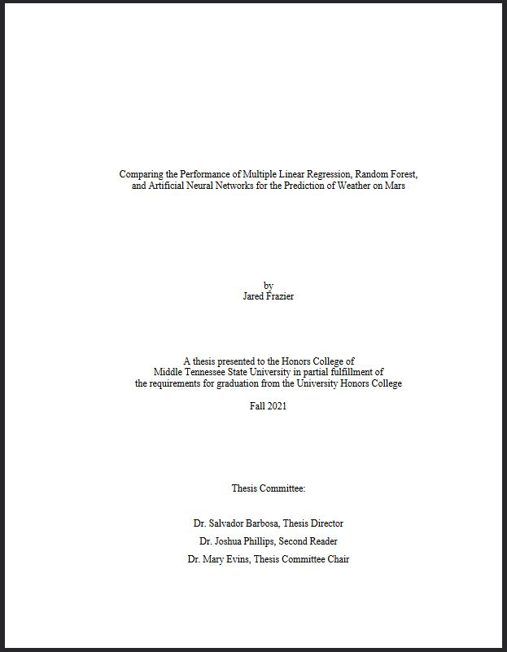

# Honors Undergraduate Thesis in Machine Learning for Weather Prediction on Mars

An end-to-end machine learning project in which I used `tensorflow` to construct recurrent neural nets and convolutional neural nets as well as `scikit-learn` to construct linear regression and random forests for multi-step ahead time series prediction of mean ambient air temperature for a region of Mars known as the Gale Crater.

# Installation

It is recommended to use [Miniconda](https://docs.conda.io/projects/conda/en/latest/glossary.html#miniconda-glossary) or [Anaconda](https://docs.conda.io/projects/conda/en/latest/glossary.html#anaconda-glossary) to install the packages for the repository.

To install the environment without GPU acceleration, run the following commands:

`conda install tensorflow scikit-learn statsmodels pandas numpy scipy requests beautifulsoup4 `

`conda install -c conda-forge matplotlib keras-tuner tqdm`

To install the environment with GPU acceleration, run the following commands:

`conda install tensorflow-gpu scikit-learn statsmodels pandas numpy scipy requests beautifulsoup4 `

`conda install -c conda-forge matplotlib keras-tuner tqdm`

# Data

Sols 1 through 2837 were scraped from the `REDUCED_DATA` archive for the NASA Curiosity Rover Environmental Monitoring System (REMS) available through the [Mars Science Laboratory](https://pds-atmospheres.nmsu.edu/data_and_services/atmospheres_data/MARS/curiosity/rems.html) using `requests `and `beautifulsoup4`. Specifically, the `REMS MODRDR` data was used since this is the most processed and therefore best prepared for data analysis. The `REMS_DESCRIPTION.txt` ([link](https://atmos.nmsu.edu/PDS/data/mslrem_1001/CATALOG/REMS_INST.CAT)) describes the instruments and operational capabilities of Curiosity's REMS. The `REMS_MORDR_DS.CAT` ([link](https://atmos.nmsu.edu/PDS/data/mslrem_1001/CATALOG/REMS_MODRDR_DS.CAT)) describes the `MODRDR` cleaned data. The `MODRDR6.FMT` ([link](https://atmos.nmsu.edu/PDS/data/mslrem_1001/LABEL/MODRDR6.FMT)) describes the format of the `MODRDR` data files. Notably, the `MODRDR` data files have the suffix `RMD` ([link](https://atmos.nmsu.edu/PDS/data/mslrem_1001/DATA/SOL_00001_00089/SOL00001/RME_397535244RMD00010000000_______P9.LBL)).

# Future Work and Reflections

I will likely use an open source MLOps library such as `neptune-client` in the future because tracking hyperparameters using `yaml` proved to be a fairly annoying task.
